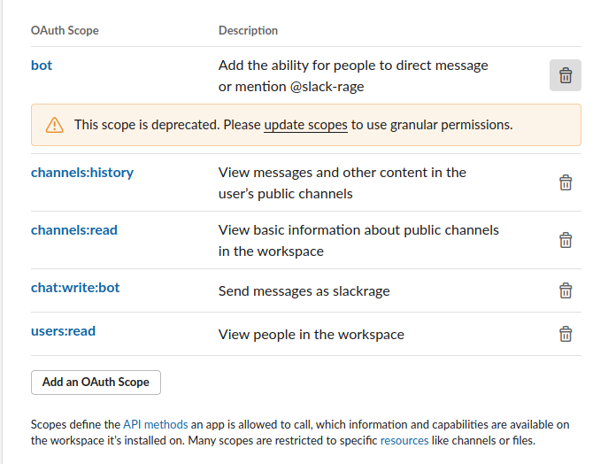
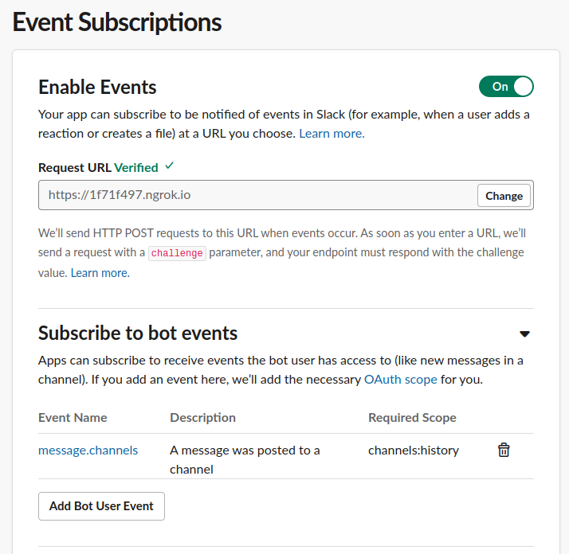

[](https://github.com/h3poteto/slack-rage/releases)

# SlackRage

SlackRage is a Slack bot. It will monitor all messages in participating channels and detects conversational excitement on these channels. It will notify the channel when excitement is detected.
This command line tool provides two methods to monitor Slack channels. First one is using RTM, and another one is using Slack Event API.

## Usage

```
$ ./slack-rage --help
Notify the rage of slack channel

Usage:
  slack-rage [command]

Available Commands:
  event       Run webhook server for slack Event API
  help        Help about any command
  rtm         Run bot using Real Time Message
  version     Print the version number

Flags:
  -h, --help   help for slack-rage
```

If you want to use RTM, please provide argument:

```
$ ./slack-rage rtm --help
Run bot using Real Time Message

Usage:
  slack-rage rtm [flags]

Flags:
  -c, --channel string   Notify channel. (default random)
  -h, --help             help for rtm
  -p, --period int       Observation period seconds for rage judgement. This CLI notify when there are more than threshold posts per period. (default 60)
  -t, --threshold int    Threshold for rage judgement. (default 10)
  -v, --verbose          Enable verbose mode
```

- `channel` Please specify Slack channel name which you want to be notified.
- `period` Observation period seconds.
- `threshold` This CLI notify when there are more than threshold posts per period in a channel.

And `event` command requires same arguments.

## Setup
You can run this CLI with docker, and start bot using RTM as default.

```
$ docker run --rm h3poteto/slack-rage ./slack-rage rtm
```

### RTM
New Slack App [does not support RTM](https://api.slack.com/rtm), so please create [Classic Slack App](https://api.slack.com/apps?new_classic_app=1).

> New Slack apps may not use any Real Time Messaging API method. Create a classic app and use the V1 Oauth flow to use RTM.


After you create a Classic app, you can get `OAuth Access Token` and `Bot User OAuth Access Token`. Please set these token to environment variables.

```
$ docker run --rm -e SLACK_TOKEN={BotUserOAuthAccessToken} -e OAUTH_TOKEN=${OAuthAccessToken} h3poteto/slack-rage
```

And please provide these scopes to the app.

- `bot`
- `channels:history`
- `channels:read`
- `chat:write:bot`
- `user:read`





Everything ok, please invite this bot user to Slack channels which you want to monitor.


### Event API
Please create a new [Slack App](https://api.slack.com/apps), and you can get `Bot User OAuth Access Token`.
Please set this token to environment variables.

```
$ docker run --rm -e SLACK_TOKEN={BotUserOAuthAccessToken} h3poteto/slack-rage event
```

You have to prepare Web server to receive webhook from Slack Event API. So please run this docker image in your server, and assign DNS, like `slack-rage.example.com`.
And please set it to RequestURL in Event Subscriptions.



Please provide these scopes to the app.

- `channels:history`
- `channels:read`
- `chat:write`
- `users:read`


Everything ok, please invite this bot user to Slack channels which you want to monitor.


## License
The package is available as open source under the terms of the [MIT License](https://opensource.org/licenses/MIT).
